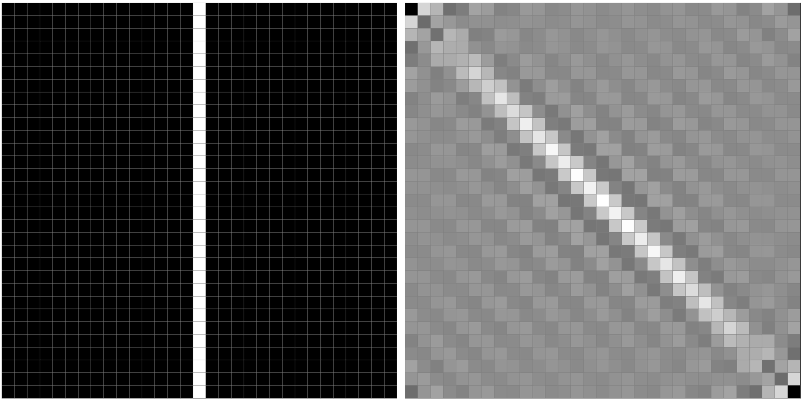

# `UnitRots`

## Unitary rotation of polychromatic images and analysis of Gibbs-like oscillations

___

This is a support repository for the upcoming research article on polychromatic images rotations and Gibbs-like oscillations analysis

**Current Caveats**: Images at almost size _N = 68_ are possible, this is because the binomial involved in the calculation of the Kravchuk matrices go overflow for greater combination values > {67, 30}.

___

**Functions provided**:

* `kmatrix(j)`gives a matrix of _(2j + 1)²_ elements filled with elements of the Kravchuk function _k(n, q; j)_. The method is implemented at `src/Krav.jl`
* `Emodes(M::Matrix, θ)` gives the elements of an image of _(2j + 1)²_ rotated by an angle θ. This method relays on a decomposition on lower and upper transformation modes `Dmodes(M::Matrix, θ)` and `Umodes(M::Matrix, θ)` whose sum entails the full rotation.

**Naive Benchmarks**:

Testing the `Emodes(M, θ)`function runtime on a test image given by a "discrete delta" centered at _q = 16_ for _j = 15_.

```julia
julia> using ImageCore
julia> julia> input = Int64.(channelview(Gray.(load("data/benchmark/delta31.png"))))
julia> julia> out = @benchmark Emodes(input, π/4)
BenchmarkTools.Trial: 1 sample with 1 evaluation.
 Single result which took 28.734 s (2.96% GC) to evaluate,
 with a memory estimate of 39.82 GiB, over 7629506 allocations.
```

We see, that for an image of _31² = 961_ pixels, we have a runtime of the function `Emodes(M, θ)` of approximately 29 seconds. Below, the original discrete delta on left side, and the rotation by π/4 on the right side.



___

README v0.1

*Authors*:

* AR. Urzúa (Theory and computational implementation) @ https://arurz.xyz/
* KB. Wolf (Theory) @ https://www.fis.unam.mx/~bwolf/

 [](https://opensource.org/licenses/MIT)

